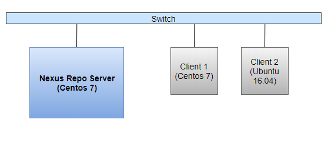

# 3.Cài đặt, cấu hình Nexus Repository


# MỤC LỤC


## 3.0.Mô hình


## 3.1.Cài đặt Nexus Repo server
\- Cài đặt Nexus Repo 3.9 trên Centos 7.5.1804.

### 3.1.1.Cài đặt Java Runtime Environment
\- Nexus Repo yêu cầu Java 8 Runtime Environment (JRE) từu Oracle. Các bản phân phối OSX và Windows bao gồm runtime environments cho hệ điều hành cụ thể, nhưng bản phân phối Unix không bao gồm runtime evironment.  
\- Bạn có thể cài đặt JDK đầy đủ hoặc chỉ JRE. Ở đây mình cài Oracle JDK 8.  
\- Download:  
```
wget --no-cookies --no-check-certificate --header "Cookie: gpw_e24=http%3A%2F%2Fwww.oracle.com%2F; oraclelicense=accept-securebackup-cookie" http://download.oracle.com/otn-pub/java/jdk/8u181-b13/96a7b8442fe848ef90c96a2fad6ed6d1/jdk-8u181-linux-x64.rpm
```

\- Cài đặt:
```
yum localinstall jdk-8u181-linux-x64.rpm
```

\- Kiểm tra phiên bản Jaca mặc định, thực hiện lệnh:  
```
java -version
```

\- Nếu hệ điều hành của bạn cài nhiều phiên bản Java JDK, ta phải thiết lập Java JDK 8 làm phiên bản mặc định, thực hiện lệnh:  
```
alternatives --config java
```

Sau đó chọn số tương ứng với Java JDK 8.  

### 3.1.2.Cài đặt Nexus Repo 3.9
\- Download:  
```
wget http://download.sonatype.com/nexus/3/nexus-3.9.0-01-unix.tar.gz
```

\- Copy file vừa download đến thư mục `/opt`:  
```
cp nexus-3.9.0-01-unix.tar.gz /opt
```

\- Giải nén:  
```
cd /opt
tar xvzf nexus-3.9.0-01-unix.tar.gz
```

Giải nén được 2 thư mục: `nexus-3.9.0-01` và `sonatype-work`.
   - Trong đó `nexus-3.9.0-01` là thư mục cài đặt: nó chứa tất cả các thành phần của ứng dụng như thư viện Java và các file cấu hình.
   - Thư mục `sonatype-work` là thư mục dữ liệu: nó chứa tất cả các repo, thành phần và một số dữ liệu khác được lưu trữ và quản lý bởi repository manager.

\- Thực hiện lệnh:  
```
mv nexus-3.9.0-01 nexus
```

\- Bắt đầu ứng dụng Nexus:  
```
cd /opt/nexus
./nexus run
```

Bạn có thể sử dụng phím `CTRL-C` để tắt tiến trình.

> Chú ý:  
Ngoài lệnh `./nexus run`, ta có thể sử dụng lệnh `./nexus start` để bắt đầu ứng dụng Nexus repo. 2 lệnh này khác nhau ở chỗ lệnh `./nexus run` chạy ở dạng tiến trình thông thường, lệnh `./nexus start` chạy ở dạng tiến trình ẩn.

\- Truy cập giao diện web diện web của nexus repo, truy cập vào đường link sau:  
```
http://<host_IP_address>:8081
```

Tài khoản mặc định:
- username: `admin`
- password: `admin123`

### 3.1.3.Chạy ứng dụng Nexus Repo như một Service
\- Tạo người dùng `nexus`:  
```
adduser nexus
usermod -d /opt/nexus nexus
```

\- Chỉ định người dùng chạy ứng dụng Nexus:  
```
echo run_as_user=\"nexus\" >> /opt/nexus/bin/nexus.rc
```

\- Tạo link liên kết, thực hiện lệnh:  
```
ln -s /opt/nexus/bin/nexus /etc/init.d/nexus
```

\- Thiết lập dịch vụ với lệnh `chkconfig`, thực hiện các lệnh sau:  
```
cd /etc/init.d
chkconfig --add nexus
chkconfig --levels 345 nexus on
service nexus start
```

## 3.2.Cấu hình Nexus Repo


## 3.3.Cài đặt plugin Nexus repository APT
\- Cài đặt git:  
```
yum install git -y
```

\- Clone project `nexus-repository-apt` :  
```
git clone https://github.com/sonatype-nexus-community/nexus-repository-apt
```

\- Thực hiện các lệnh sau:  
```
cd nexus-repository-apt
git tag -l
git checkout 1.0.5
git branch -D master
git checkout -b master
```

\- Cài đặt Apache Maven:  
- Tải file apache-maven:  
```
cd /usr/local/src
wget http://www-us.apache.org/dist/maven/maven-3/3.5.4/binaries/apache-maven-3.5.4-bin.tar.gz
```

- Sau khi tải về, giải nén và đổi tên thư mục:   
```
tar -xf apache-maven-3.5.4-bin.tar.gz
mv apache-maven-3.5.4/ apache-maven/ 
```

- Cấu hình biến môi trường cho Apache Maven:  
```
cd /etc/profile.d/
vi maven.sh
```

Thêm nội dung sau vào file `maven.sh`:  
```
# Apache Maven Environment Variables
# MAVEN_HOME for Maven 1 - M2_HOME for Maven 2
export M2_HOME=/usr/local/src/apache-maven
export PATH=${M2_HOME}/bin:${PATH}
```

- Thêm quyền thực thi cho file `maven.sh` và load cấu hình:  
```
chmod +x maven.sh
source /etc/profile.d/maven.sh
```

- Kiểm tra phiên bản Apache Maven:  
```
mvn --version
```

Nội dung đầu ra tương tự như sau:  
```

```

\- Xây dựng plugin: vẫn trong thư mục nexus-repository-apt, thực hiện lệnh:  
```
mvn
```

Quá trình thực hiện khá lâu, khoảng 10' - 20'.  

\- Tạo file `.jar`: vẫn trong thư mục nexus-repository-apt, thực hiện lệnh:  
```
mvn package
```

Thư mục mới được tạo ra có tên `target`, trong thư mục chứa file `nexus-repository-apt-1.0.4.jar`.  

\- Cài đặt:  
- Stop dịch vụ Nexus:  
```
service nexus stop
```

- Tạo thư mục `/opt/nexus/system/net/staticsnow/nexus-repository-apt/1.0.4`:  
```
mkdir -p /opt/nexus/system/net/staticsnow/nexus-repository-apt/1.0.4
```

- Copy file `nexus-repository-apt-1.0.4.jar` đến thư mục vừa tạo:  
```
cp nexus-repository-apt-1.0.4.jar /opt/nexus/system/net/staticsnow/nexus-repository-apt/1.0.4
```

\- Sửa file `/opt/nexus/system/com/sonatype/nexus/assemblies/nexus-oss-feature/3.9.0-01/nexus-oss-feature-3.9.0-01-features.xml`:  
```
        <feature version="3.9.0.01" prerequisite="false" dependency="false">nexus-repository-yum</feature>
+       <feature prerequisite="false" dependency="false">nexus-repository-apt</feature>
        <feature version="3.9.0.01" prerequisite="false" dependency="false">nexus-repository-gitlfs</feature>
    </feature>
```

và  
```
+ <feature name="nexus-repository-apt" description="net.staticsnow:nexus-repository-apt" version="1.0.4">
+     <details>net.staticsnow:nexus-repository-apt</details>
+     <bundle>mvn:net.staticsnow/nexus-repository-apt/1.0.4</bundle>
+ </feature>
 </features>
```

> Chú ý:  
Dòng có dấu + ở đầu là nội dung cần được thêm.  

\- Start dịch vụ Nexus:  
```
service nexus start
```


